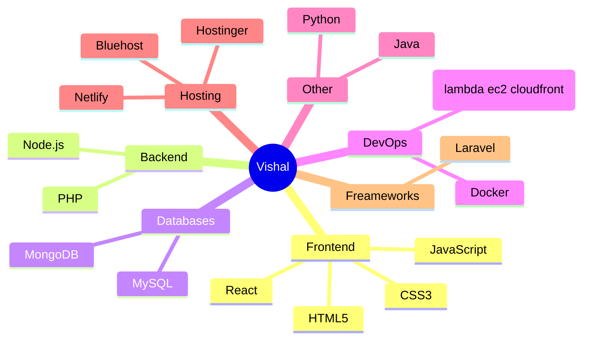

# Hi there! I'm Vishal Kushwaha 👋

  

  

<h2 align="center">🚀 Tech Cosmos</h2>

  

<h2 align="center">📊 GitHub Metrics</h2>

  
  

<h2 align="center">🌟 Language Proficiency</h2>

  

<h2 align="center">🤝 Let's Connect</h2>

  
  
  

 

  

  

